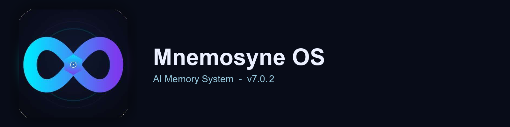

<p align="center">
  
</p>

# Mnemosyne OS ☤

<p align="center">
  <a href="https://pypi.org/project/mnemosyne-os/">Mnemosyne OS</a> | <a href="https://github.com/FrankHu-HK/mnemosyne">GitHub</a> | <a href="README.md">English</a>
</p>

<p align="center">
  <a href="https://pypi.org/project/mnemosyne-os/"></a>
  <a href="LICENSE"></a>
  <a href="https://www.python.org/"></a>
  <a href="https://modelcontextprotocol.io/"></a>
 <a href="https://pepy.tech/projects/mnemosyne-os"></a>
 <a href="https://x.com/mnemosyne_oos"></a>
  <a href="https://github.com/FrankHu-HK/mnemosyne/blob/main/README.md"></a>
  <a href="https://github.com/FrankHu-HK/mnemosyne/blob/main/README_TW.md"></a>
  <a href="https://github.com/FrankHu-HK/mnemosyne/blob/main/README.es.md"></a>
  <a href="https://github.com/FrankHu-HK/mnemosyne/blob/main/README.ru.md"></a>
  <a href="https://github.com/FrankHu-HK/mnemosyne/blob/main/README.de.md"></a>
  <a href="https://github.com/FrankHu-HK/mnemosyne/blob/main/README.th.md"></a>
  <a href="https://github.com/FrankHu-HK/mnemosyne/blob/main/README.ko.md"></a>
  <a href="https://github.com/FrankHu-HK/mnemosyne/blob/main/README.ja.md"></a>
</p>

**Mnemosyne OS 7.0.0** — 零依赖 (zero-dependency)、本地优先 (local-first) 的 AI 記憶系統 (AI memory system)，支持多層次遺忘 (multi-tier forgetting)、哈希鏈賬本 (hash-chain ledger)、插件 SDK (plugin SDK)、本地 Web 管理界面 (local web dashboard) 与 MCP (Model Context Protocol / 模型上下文協定) 協定。

> 唯一核心**零第三方依赖** (仅依赖 Python 標準庫 3.8+) 的 AI 記憶引擎 —— 無需向量庫 (vector database)、無需大語言模型 (LLM) 运行時、無云端鎖定 (no cloud lock-in)。可在笔记本、服務器或無服務器架構 (serverless) 上运行。

可作為 **Python 庫 (Python library)**、**命令行 (CLI)**、**HTTP API (API 介面)**、**MCP 服務器 (MCP server)** 使用，或通過 **MCP (模型上下文協定)** stdio 传輸嵌入。

<table>
<tr><td><b>零依赖核心 (Zero-dependency core)</b></td><td>仅需 Python 標準庫即可运行，儲存与檢索記憶無需 numpy、torch、向量庫或大語言模型。</td></tr>
<tr><td><b>多層次記憶 (Multi-tier memory)</b></td><td>热/溫/冷三層儲存与遺忘經濟學 (economic forgetting) —— 低價值記憶遷移，而非静默刪除。</td></tr>
<tr><td><b>哈希鏈賬本 (Hash-chain ledger)</b></td><td>SHA-256 鏈式賬本，<code>verify_chain()</code> 檢測篡改并定位被篡改记錄。</td></tr>
<tr><td><b>插件 SDK (Plugin SDK)</b></td><td><code>VectorBackendPlugin</code> / <code>CryptoPlugin</code> / <code>RerankerPlugin</code> + 官方插件 (<code>numpy_vector</code> / <code>crypto</code> / <code>reranker</code> / <code>hrr</code> / <code>async</code> / <code>context-engine</code>)。</td></tr>
<tr><td><b>MCP 服務器 (MCP server)</b></td><td>13 個工具 (stdio JSON-RPC)，支持令牌鉴權 (token auth) 与多租戶命名空間隔離 (multi-tenant namespaces)。</td></tr>
<tr><td><b>Web 管理界面 (Web dashboard)</b></td><td>本地科技感暗色面板 (dark dashboard)，無外部 CDN —— 由 <code>web_server.py</code> 提供。</td></tr>
<tr><td><b>異步 API (Async API)</b></td><td><code>AsyncMemoryBrain</code> 異步封装，支持高吞吐寫入。</td></tr>
<tr><td><b>中文优化 (Chinese-optimized)</b></td><td>二分词 (bigram tokenization) + FTS5 + 内置同義词词典 (synonym dictionary)。</td></tr>
<tr><td><b>安全檢查 (Security notary)</b></td><td>檢測凭据、不可见 Unicode 与 HTML 註入；寫入前字段級脫敏 (field-level redaction)。</td></tr>
</table>

---

## 快速安裝 (Quick Install)

### 通過 PyPI 安裝

```bash
pip install mnemosyne-os
```

### 零依赖核心（無需 pip install）

```bash
# 核心仅依赖 Python 標準庫即可运行
python -c "from mnemosyne import MemoryBrain; print('Ready!')"
```

### 開發模式安裝

```bash
git clone https://github.com/FrankHu-HK/mnemosyne.git
cd mnemosyne
pip install -e .
```

---

## 快速開始 (Getting Started)

### 命令行 (CLI)

```bash
# 初始化記憶資料庫
python mnemosyne.py --dir ./mem init

# 儲存一條記憶
python mnemosyne.py --dir ./mem retain --content "苹果公司成立于1976年"

# 檢索記憶
python mnemosyne.py --dir ./mem recall "苹果" --k 5

# 合并相似記憶（預檢）
python mnemosyne.py --dir ./mem consolidate --dry-run

# 查看状态 / 健康檢查
python mnemosyne.py --dir ./mem status --json
python mnemosyne.py --dir ./mem doctor --json

# 知識圖谱查询
python mnemosyne.py --dir ./mem graph-query "张三" --depth 2 --json

# 賬本完整性校驗 / 审计
python mnemosyne.py --dir ./mem verify-integrity --json
python mnemosyne.py --dir ./mem ledger-audit <memory_id>

# 導出 / 導入
python mnemosyne.py --dir ./mem export --format json --out ./memories.json
python mnemosyne.py --dir ./mem import ./memories.json

# 遷移 JSONL -> SQLite
python mnemosyne.py --dir ./mem migrate --jsonl ./mem/index.jsonl

# 啟动 Web 管理界面
python -m mnemosyne.webui.web_server --port 9090
```

### Python 介面 (Python API)

```python
from mnemosyne import MemoryBrain

brain = MemoryBrain("./my_memories", enable_embeddings=False)
brain.ensure_init()

# 儲存
brain.retain("苹果公司成立于1976年", fast=True)

# 檢索
results = brain.recall("苹果", k=5)
for score, record, reasons in results:
    print(f"Score: {score:.4f} | {record['content']}")

# 按 Token 預算檢索
results, cost_report = brain.recall("苹果", k=5, budget_tokens=100)

# 會話歷史
brain.add_conversation_turn("session-1", "user", "Tell me about Apple")
hits = brain.search_conversations("Apple", session_id="session-1")

# 上下文快照
snapshot = brain.build_context_prompt(query="Apple", max_chars=2000)
```

### 異步介面 (Async API)

```python
import asyncio
from plugins.async_wrapper import AsyncMemoryBrain

async def main():
    brain = AsyncMemoryBrain("./memories", enable_embeddings=False)
    await brain.async_retain("Hello World", fast=True)
    results = await brain.async_recall("Hello", k=5)
    print(results)
    brain.close()

asyncio.run(main())
```

### MCP 服務器 (MCP Server)

通過 stdio JSON-RPC（標準 JSON-RPC 传輸）运行 MCP 服務器：

```bash
export MNEMOSYNE_MCP_TOKEN="your-secret-token"   # 可選令牌鉴權
python -m mnemosyne.webui.mcp_server --brain-dir ./mem --namespace default
```

MCP 服務器暴露 **13 個工具 (13 tools)**：

| 工具 (Tool) | 說明 (Description) |
| --- | --- |
| `retain` | 寫入記憶 |
| `recall` | 檢索記憶 |
| `retain_batch` | 批量寫入，约 15 倍加速 |
| `stats` | 运行统计 —— 寫入/召回/Token 节省 |
| `graph_query` | 知識圖谱查询 |
| `temporal_query` | 時序版本鏈查询 |
| `list_projects` | 列出隔離項目 |
| `doctor` | 健康檢查 —— 完整性/记錄數/磁盤 |
| `audit` | 审计追踪查询 |
| `confidence_history` | 置信度轨迹查询 |
| `memory/export-v1` | 記憶交換協定導出 |
| `memory/import-v1` | 記憶交換協定導入 |
| `memory/claim` | 認领外部導出記憶 |

将任意 MCP 宿主（Claude Desktop、Hermes Agent 等）指向上述 stdio 命令即可接入。

### HTTP API / Web 管理界面

```bash
python -m mnemosyne.webui.web_server --port 9090
```

打開 `http://127.0.0.1:9090` —— 本地暗色面板 (dark dashboard)，支持記憶浏览、圖谱視圖、统计与 REST (表述性状态传递) 介面。首次运行创建默認賬號 `admin / mnemosyne`，登錄後请修改密碼。

---

## 插件 (Plugins)

```python
# Crypto 插件（需 cryptography；缺失時优雅降級）
brain = MemoryBrain("./memories", plugins=["crypto"])

# Numpy 向量後端（需 numpy；可選 sentence-transformers 模型）
brain = MemoryBrain("./memories", plugins=["numpy_vector"])

# Reranker 插件
brain = MemoryBrain("./memories", plugins=["reranker"])
```

---

## 項目結構 (Project Structure)

```
Mnemosyne7.0.0/
├── mnemosyne.py              # 薄門面，重新導出 mnemosyne 包
├── mnemosyne/                # 核心引擎包（brain / storage / retrieval / cognitive / notary）
├── storage/                  # 儲存後端（sqlite_backend / ledger / session_store / plugin_sdk）
├── context/                  # 上下文快照（snapshot_builder）
├── context_engine/           # 上下文压缩引擎（引擎無關核心 + Hermes 適配器）
├── lexical/                  # 内置同義词词典
├── profiles/                 # 用戶畫像管理
├── providers/                # 外部 Provider 適配器 + 多源路由
├── security/                 # 矛盾檢測 + 安全报告
├── session/                  # 會話導入器
├── visualization/            # 知識樹生成器
├── plugins/                  # 额外插件（HRR / Async）
├── mnemosyne_plugins/        # 官方插件（numpy_vector / crypto / reranker）
├── examples/                 # 可运行示例（Ollama / LangChain / MCP / CLI / embedded）
└── docs/                     # 文檔（架構、模塊、插件、API、部署）
```

## 測试 (Testing)

```bash
python -m unittest discover -s tests -v
python -m unittest tests.test_plugins -v
```

## 文檔 (Documentation)

- `README.md` — 英文說明 (English README)
- `docs/` — 完整文檔：架構、資料模型、模塊文檔、插件文檔、API / CLI / MCP 參考、部署、集成
- `COMPLIANCE.md` — HIPAA / 等保 / GDPR / PIPL 合规映射
- `comparison.md` — 与同類框架的功能對比
- `CHANGELOG.md` — 版本变更记錄
- 报告：`quality_report.md`（檢索质量）、`benchmark_report.md`（性能基準）、`security_report.md`（安全測试）

## 许可證 (License)

MIT 许可證 —— 见 [LICENSE](LICENSE)。

開發者：胡景堃 (Jingkun Hu)。

> 本文件為機器翻譯，英文版（README.md）為權威版本。
